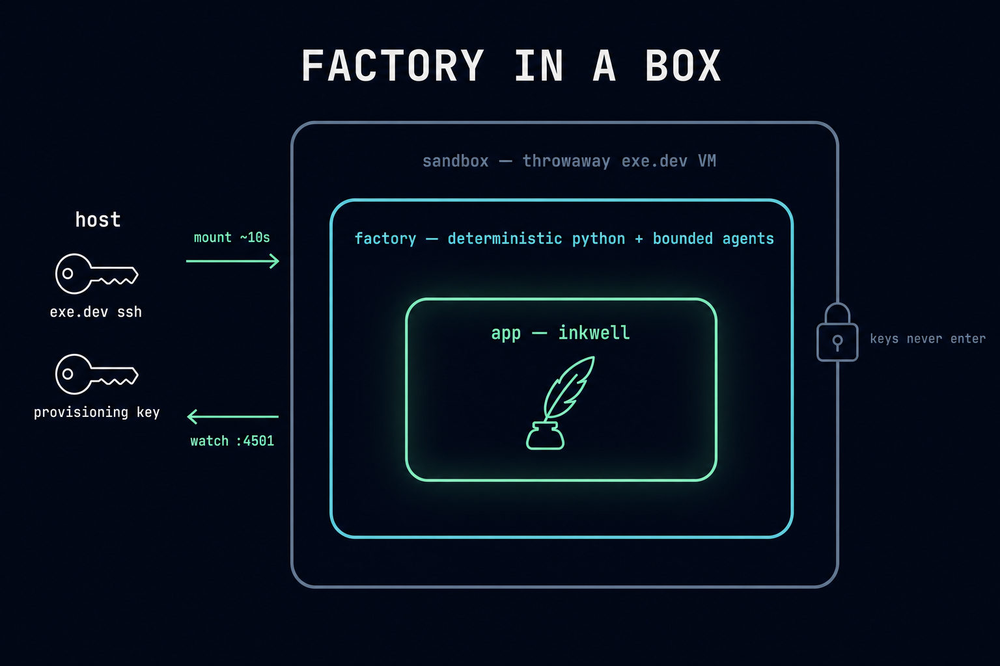
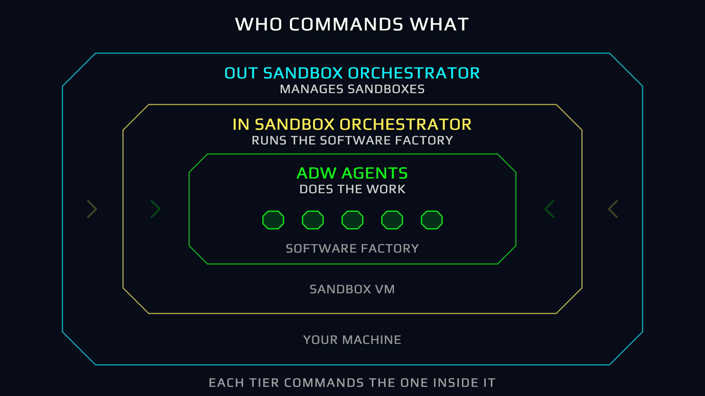
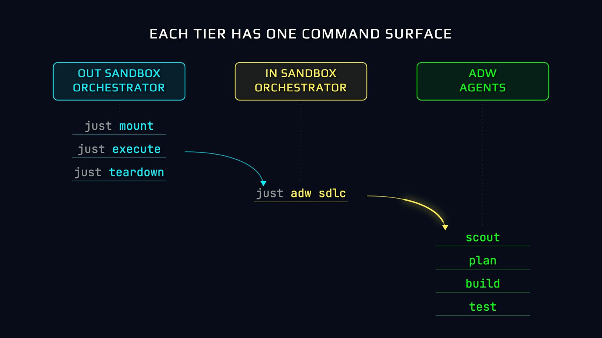
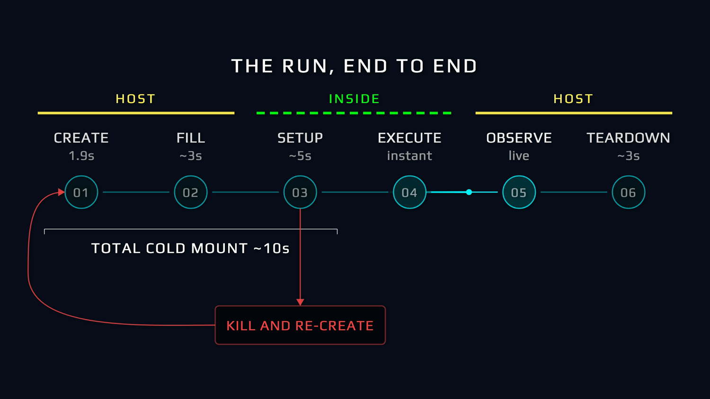
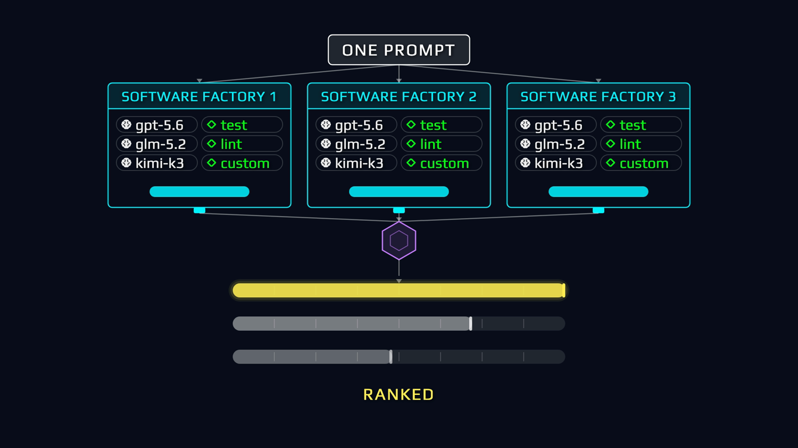
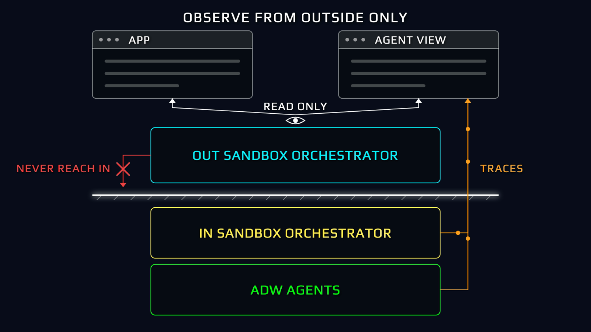

# Factory In A Box

> **A blog app, the software factory that builds it, and the throwaway sandbox that runs both.**
> For engineers who want agents shipping code without a human in the loop.

<p align="center">
  
</p>

Three tiers nest here: **Inkwell** (a minimalist blog-writing app), the **Super Simple Software Factory** (deterministic Python owns the graph, coding agents are bounded phases inside it), and the **sandbox mount system** (six host-side phases that stand the other two up on a disposable VM in ~10 seconds). The app is the payload. **The point is the loop that ships it without you in the middle.**

---

## Install

### Agentic Install

```bash
claude               # boot Claude Code in the repo root
/prime               # orients the agent on all three tiers, checks live state
```

`/prime` lives at `.claude/commands/prime.md`. It walks the agent through the command surface, the specs, the measured gotchas, and ends with a live `just sbx manage doctor` preflight.

### Manual Install

**Prereqs:** [`bun`](https://bun.sh), [`uv`](https://docs.astral.sh/uv/), [`just`](https://just.systems), an [exe.dev](https://exe.dev) account, an [OpenRouter](https://openrouter.ai) provisioning key.

```bash
cp .env.sample .env                  # add OPENROUTER_PROVISIONING_KEY (host-only, never leaves)
cd apps/inkwell && bun install       # app deps
just sbx manage doctor               # six-check preflight: ssh, key, helpers, rates, adw layer
just inkwell test                    # 30 tests green = the payload works
```

---

## Why this exists

<p align="center">
  
</p>

A system that needs you at every step does not scale, and you become the key-man risk in your own factory. The goal is the right side of that diagram: the loop orbits, you read the trace. Isolation is what makes it safe to let go.

<p align="center">
  
</p>

The controversial call, stated plainly: **the coding agents run inside the sandbox**, not outside it driving a remote shell. Claude Code and Pi are installed on the VM, in the same room as the codebase. The host keeps only a thin orchestrator and two credentials that never leave.

---

## Who commands what

<p align="center">
  
</p>

Three command tiers, and each one commands only the tier inside it:

| Tier | Lives | Does |
| --- | --- | --- |
| **Out-sandbox super orchestrator** | your machine | mounts, fills, observes, harvests, tears down sandboxes |
| **In-sandbox orchestrator agent** | the VM, a resumable Claude Code session | receives delegated work, launches the factory, watches it, reports |
| **ADW agents** | bounded phases inside the factory | scout, plan, build, review, document |

<p align="center">
  
</p>

Work crosses the boundary on one of two paths, and the difference is who pulls the trigger inside:

| Path | Verb | Mechanism |
| --- | --- | --- |
| **Direct** | a command | `just sbx lifecycle execute` detaches the factory process itself: reproducible, pid-tracked, zero orchestration tokens |
| **Agent-mediated** | a delegation | `just sbx run agent` briefs the in-sandbox orchestrator, and *it* launches the factory: judgment at the kickoff, conversational, resumable |

Every delegation opens with the equip line, so the in-box agent routes instead of improvising:

```bash
just sbx run agent <id> "If you have not already: READ and EXECUTE .claude/skills/sssf/SKILL.md. Then: <work>"
```

---

## Tier 1 — Inkwell, the payload

<p align="center">
  
</p>

A blog-writing app: drafts, a markdown editor with live preview, one-click publish. Bun + `bun:sqlite`, zero dependencies, vanilla JS front end, port 4501. It is small on purpose: small enough to rebuild end to end, over and over, by agents. The 30-test suite is what the factory's test phase runs, by name, as code rather than an agent decision.

```bash
just inkwell run      # boot on :4501
just inkwell dev      # reload-on-save
just inkwell test     # the suite the factory runs
```

## Tier 2 — the factory

<p align="center">
  
</p>

Twelve ADWs (AI Developer Workflows) under `adws/`, each a thin `uv run` script whose docstring is its chain: `adw_simple_sdlc` runs plan → build → test → review → document with three separate commits. Typed envelopes carry context between phases; gates validate every claim, and a failure re-enters the same session as a correction, never a restart. **Agent proposes, code disposes.**

Staffing is one config file, swappable per run. Five rosters ship in `adws/adw_sssf_config/`: the cheap default, the frontier roster, pure DeepSeek, open-weights, and top-speed. The factory's full anatomy (envelopes, gates, prompts, the skill that stamps it into any repo) has its own codebase; this repo runs it.

## Tier 3 — the sandbox

<p align="center">
  
</p>

Six phases take a blank exe.dev VM to a health-checked, running factory in ~10 measured seconds: create → fill → setup → execute → observe → teardown. Every phase is a `just` recipe a human could type; the run record on disk is the only state they share, so any crash leaves teardown a handle.

<p align="center">
  
</p>

The whole repo ships to the VM. What a sandbox cannot do is *use* the orchestration half, because the exe.dev account and the OpenRouter provisioning key never leave the host. Each run gets a disposable `sbx-` key with a $50 cap, revoked at teardown. **One level of nesting, enforced by credentials rather than by deleting files.**

<p align="center">
  
</p>

Fan-out is a loop over configs: one prompt, N rosters, N boxes. Teardown is never automatic, and harvest never merges: a run's commits come home as `refs/sandbox/<run-id>`, parked for a human to compare and choose the winner.

---

## Watch it run

<p align="center">
  
</p>

You watch from outside; you never reach in. Every phase, tool call, complete thought, and complete response streams into `sssf.db` as it happens (agents → sqlite → you, WAL so reads never block writers), and the visualizer polls it.

<p align="center">
  
</p>

Each sandbox exposes two ports: the app is public, the agent view stays auth-gated to you. Ship the app; keep the factory floor private.

```bash
just obs ui                 # boot the observability UI
just obs sessions           # recent runs
just obs tail <adw_id>      # live event tail
just sbx manage list        # every sandbox: state, VM alive, spend
```

---

## The command surface

Five namespaces, and the namespace answers *where the work happens*:

```
justfile
├── inkwell     boot and test the app itself: run / dev / test
├── adw         the workflows: sdlc, build-test, scout, simple-sdlc … (runs IN a sandbox)
├── sbx         sandbox orchestration: mount, lifecycle, run, manage, orch (host-only)
├── obs         read the trace: sessions, phases, tail, procs, ui
└── local       boot an orchestrator agent on THIS machine: cc / pi / ipi
```

```bash
just sbx mount my-feature                                  # blank VM → running factory, ~10s
just sbx run cmd <id> 'tail -f run.log'                    # look inside, synchronously
just sbx manage harvest <id>                               # commits home → refs/sandbox/<id>
just sbx lifecycle teardown <id>                           # human decision, always
```

---

## Where it can still fail

Every one of these was measured on live hardware, and each cost a debugging cycle:

- **A just module inherits nothing.** Not variables, not settings, not the working directory. Every module re-declares what it needs; each missing line fails in a different silent way.
- **`pi --list-models` exits 0 while printing "No models available."** Health checks assert on output, never `$?`.
- **A partial cost block drops the whole roster.** pi requires all four rate fields; miss one and every run reports $0.0000 while genuinely spending.
- **Never `apt` in the mount path.** ~35s per package from the `dal` region; bun and just come from their own CDNs in about a second.
- **An unsynced golden-VM clone produced 5,641 zero-byte files** and every naive check passed. Gates check content, not existence.

The deep list lives in `.claude/skills/sssf-sandbox-orchestrator/references/gotchas.md`.

---

## License

MIT — see [`LICENSE`](LICENSE).

---

## Master Agentic Coding

Prepare for the future of software engineering.

Learn tactical agentic coding patterns with [Tactical Agentic Coding](https://agenticengineer.com/tactical-agentic-coding?y=inkwell).

Follow the [IndyDevDan YouTube channel](https://www.youtube.com/@indydevdan) to improve your agentic coding advantage.

---

Stay Focused and Keep Building

- IndyDevDan
